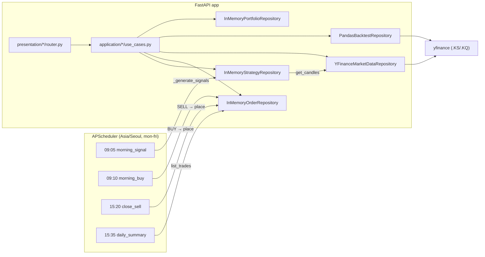

# Quant 프로젝트 분석 보고서

> 작성일: 2026-05-08
> 대상 커밋: `main` 브랜치 워킹 트리 기준

## 1. 한 줄 요약

`yfinance`로 한국 주식 데이터를 가져와 **MA5/MA20 골든크로스 전략**으로 시그널을 만들고, **APScheduler**로 장중에 자동 매매(현재는 인메모리 모의 체결)를 돌리는 **FastAPI + DDD 구조**의 자동매매/백테스트 서비스입니다. 과거 토이 프로젝트(`restful-booker` 예약 CRUD)가 동일 레포에 함께 남아 있는 상태입니다.

## 2. 기술 스택

- **Python 3.13**, **FastAPI 0.115**, **Uvicorn**
- **Pydantic v2 / pydantic-settings** — 스키마 검증, `.env` 로딩
- **httpx 0.27** — 외부 HTTP 클라이언트 (booking 도메인)
- **yfinance 0.2.54 + pandas 2.2** — 시세, 백테스트 데이터
- **APScheduler 3.11** — 장중 크론 잡 (`Asia/Seoul` 타임존)

`requirements.txt`는 [`requirements.txt`](../requirements.txt)에 정리되어 있습니다.

## 3. 디렉터리 구조 (DDD 4-레이어)

[`.claude/skills/ddd-fastapi/SKILL.md`](../.claude/skills/ddd-fastapi/SKILL.md)에 정의된 규칙을 거의 정확히 따르고 있습니다.

```
app/
├── main.py                      # FastAPI 진입점 + lifespan에 스케줄러 연결
├── config.py                    # pydantic-settings (BOOKER_* 만 있음)
├── scheduler/trading_job.py     # APScheduler 잡 정의 (09:05/09:10/15:20/15:35)
├── domain/                      # entity, repository(Protocol), exceptions
│   ├── strategy / order / market_data / portfolio / backtest / booking
├── application/                 # commands(=DTO), use_cases(=비즈니스 로직)
│   └── (동일 6개 도메인)
├── infrastructure/              # 도메인별 Protocol 구현
│   ├── strategy/strategy_repository.py        # InMemory + 골든크로스 계산
│   ├── order/order_repository.py              # InMemory, 즉시 FILLED 모의 체결
│   ├── market_data/market_data_repository.py  # YFinance + ThreadPoolExecutor
│   ├── portfolio/portfolio_repository.py      # 더미 데이터 하드코딩
│   ├── backtest/backtest_repository.py        # pandas 시뮬레이션 + 인메모리 캐시
│   └── booking/http_repository.py             # httpx (외부 API)
└── presentation/                # FastAPI 라우터 + Pydantic 스키마
```

의존 방향 `Presentation → Application → Domain ← Infrastructure` 가 잘 지켜져 있습니다.

## 4. 도메인별 책임 한눈에

| 도메인 | 핵심 엔티티 | 인프라 구현 | 비고 |
|---|---|---|---|
| `strategy` | `Strategy`, `Signal(BUY/SELL/HOLD)` | `InMemoryStrategyRepository` + `golden-cross` 기본 전략 | MA5×MA20 교차로 시그널 계산 |
| `order` | `Order(PENDING/FILLED/CANCELLED)`, `Trade` | `InMemoryOrderRepository` (place 즉시 FILLED) | 모의 체결, 실거래 미연동 |
| `market_data` | `Stock`, `Candle`, `Ticker` | `YFinanceMarketDataRepository` (`.KS`/`.KQ` 자동 탐색) | 동기 호출을 ThreadPool로 비동기화 |
| `portfolio` | `Position`, `Balance` | `InMemoryPortfolioRepository` (삼성전자/SK하이닉스 더미) | TODO에 KIS API 교체 명시 |
| `backtest` | `BacktestResult`, `PerformanceMetrics` | `PandasBacktestRepository` (CAGR/MDD/Sharpe/승률) | 결과는 인메모리 캐시 |
| `booking` | `Booking`, `BookingWithId` | `HttpBookingRepository` (`restful-booker.herokuapp.com`) | **현재 도메인과 무관한 잔존 코드** |

## 5. 데이터 흐름



## 6. 엔드포인트 맵 ([`app/main.py`](../app/main.py)에서 등록)

- `GET /health`
- `/bookings` — list/get/create/update/patch/delete (외부 `restful-booker`)
- `/market-data/stocks/search`, `/stocks/{code}/candles`, `/stocks/{code}/ticker`
- `/strategies` — list/get/create, `GET /strategies/{id}/signal?code=...`
- `/orders` — POST 주문, DELETE 취소, GET 단건/체결내역
- `/portfolio/balance`, `/portfolio/positions`, `/portfolio/positions/{code}`
- `/backtest/run`, `/backtest/results/{result_id}`

## 7. 잘된 점

- **DDD 레이어링이 일관됨** — `Protocol` 기반 의존성 역전, 라우터에서 `Depends(get_use_cases)`로 인프라를 주입.
- **불변성 원칙 준수** — 모든 엔티티/커맨드가 `@dataclass(frozen=True)`.
- **비동기-동기 경계 처리** — `yfinance`(동기 라이브러리)를 `ThreadPoolExecutor`로 감싸 이벤트 루프를 막지 않음 ([`market_data_repository.py`](../app/infrastructure/market_data/market_data_repository.py), [`backtest_repository.py`](../app/infrastructure/backtest/backtest_repository.py)).
- **스케줄러를 lifespan에 묶음** — 앱 시작/종료와 스케줄러 라이프사이클이 동기화 ([`app/main.py`](../app/main.py) 라인 20-27).
- **백테스트 지표가 실제 공식 기반** — CAGR, MDD, Sharpe(연 252일·일간 무위험 0.035/252), 승률.

## 8. 위험·이슈 (우선순위 높은 것부터)

1. **Order 저장소 인스턴스가 두 곳에 따로 존재** — 스케줄러는 [`app/scheduler/trading_job.py`](../app/scheduler/trading_job.py)의 `_order_repo`를, REST는 [`app/presentation/order/router.py`](../app/presentation/order/router.py)의 별도 `_order_repo`를 사용합니다. **자동매매로 들어간 주문이 `GET /orders/trades`에 보이지 않습니다.** (Strategy/MarketData 인스턴스도 동일하게 분리됨)
2. **인증/권한 전무** — `/orders` POST, `/backtest/run` 등 비용이 큰 외부 호출이 누구에게나 열려 있음.
3. **모의 체결의 `price=0` 그대로 저장** — 시장가 주문이 `Trade.price=0`으로 기록됨 ([`order_repository.py`](../app/infrastructure/order/order_repository.py) 라인 42). 일일 요약에서도 0원으로 찍힘.
4. **`InMemory*` 저장소 → 재시작 시 모든 상태 소실** — 전략/주문/체결/포트폴리오/백테스트 캐시 전부.
5. **환경변수가 booking 전용** — [`app/config.py`](../app/config.py)에 `BOOKER_*`만 있고 향후 KIS API 키, 워치리스트 등이 들어갈 자리가 없음. 워치리스트는 `_WATCH_CODES` 하드코딩 ([`trading_job.py`](../app/scheduler/trading_job.py) 라인 37).
6. **`HttpBookingRepository._token` 캐시가 만료/실패 처리 없음** + `print(f"발급된 토큰: {self._token}")`로 평문 로그 ([`http_repository.py`](../app/infrastructure/booking/http_repository.py) 라인 28).
7. **`yfinance` 가격을 `int()`로 캐스팅** — [`market_data_repository.py`](../app/infrastructure/market_data/market_data_repository.py) 라인 75-79, `_get_ticker` 라인 93-94. 미국 ETF나 소수점 가격은 정밀도 손실. KOSPI/KOSDAQ는 원 단위라 보통은 OK이지만 ADR/해외 종목 확장 시 깨짐.
8. **Position의 `current_price`/`profit_loss`가 더미값 고정** — `MarketDataRepository`로 실시세를 합산해 계산하지 않음.
9. **백테스트 통화/단위 가정** — KOSPI(`.KS`) 실패 시 KOSDAQ(`.KQ`) 재시도만 하고, 종목별 액면분할/배당 보정은 없음.
10. **테스트 코드 0개** — [`.claude/TODO.md`](../.claude/TODO.md)에도 명시된 항목.
11. **Booking 도메인 잔존** — 도메인 컨텍스트(자동매매)와 무관. 학습 흔적이 그대로 남아 있어 정리 필요.
12. **Repository를 라우터 모듈 전역 변수로 들고 있음** — 테스트에서 의존성 오버라이드는 가능하지만, 모듈 import 시점에 `YFinanceMarketDataRepository()`가 만들어져 단위테스트가 무거워짐.

## 9. 다음 단계 우선순위

[`.claude/TODO.md`](../.claude/TODO.md)에 적힌 3가지 + 위 분석을 합치면 자연스러운 우선순위는:

1. **공유 컨테이너로 InMemory 저장소를 단일화** — 라우터/스케줄러가 같은 인스턴스 사용 (가장 시급).
2. **`_WATCH_CODES`/리스크 한도/모의 체결 가격 등을 `Settings`로 빼기** + KIS API 자리 마련.
3. **KIS OpenAPI 어댑터** (`infrastructure/order/kis_order_repository.py`, `kis_market_data_repository.py`) 추가 → Protocol 기반이라 라우터/유스케이스 변경 없음.
4. **테스트 도입** — pytest + httpx `AsyncClient`, 골든크로스 단위테스트, 백테스트 결과 스냅샷.
5. **전략 추가** — RSI, 볼린저밴드 (Strategy 엔티티에 `params` 필드 추가 필요).
6. **Booking 도메인 분리/제거** — 별도 학습용 브랜치로 빼거나 삭제.
7. **`/orders`, `/backtest/run`에 인증/레이트리밋** — `FastAPI` 의존성으로 API 키 검증.
